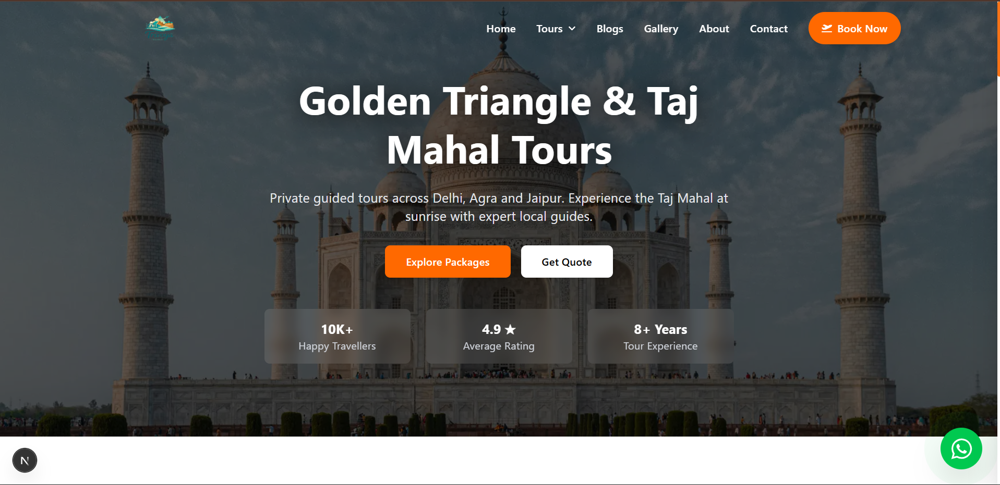
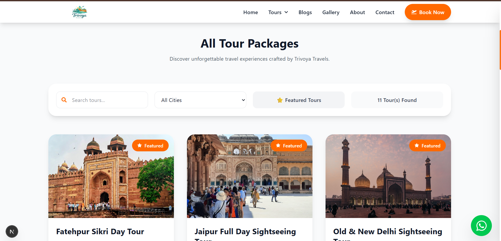
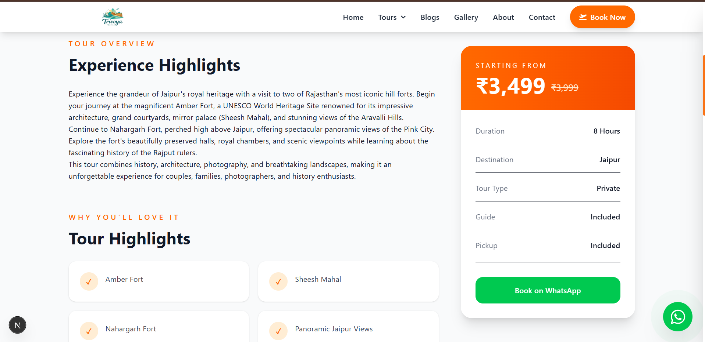
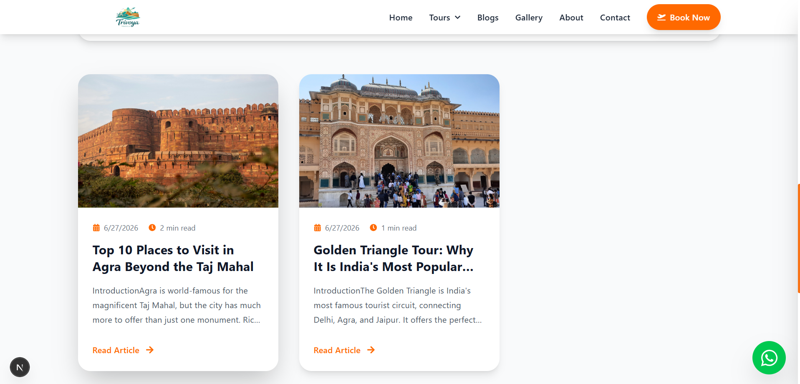
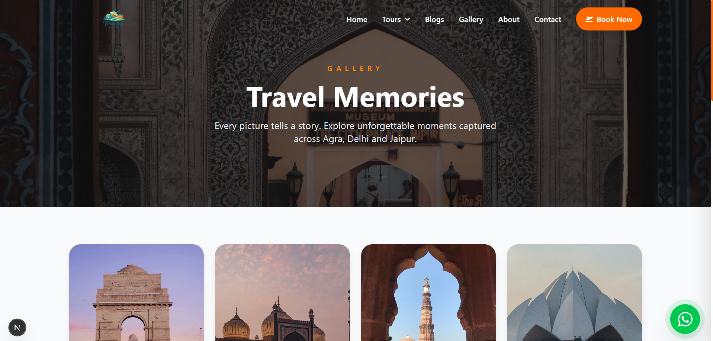
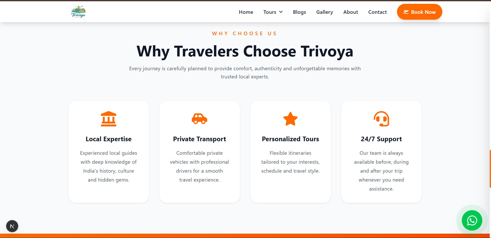
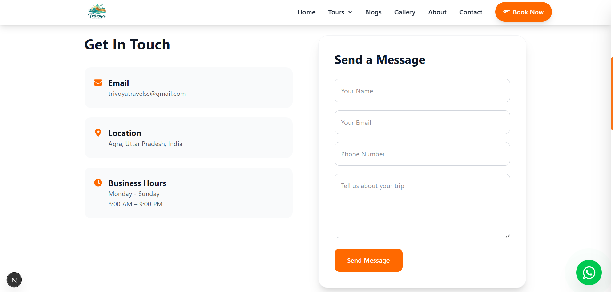
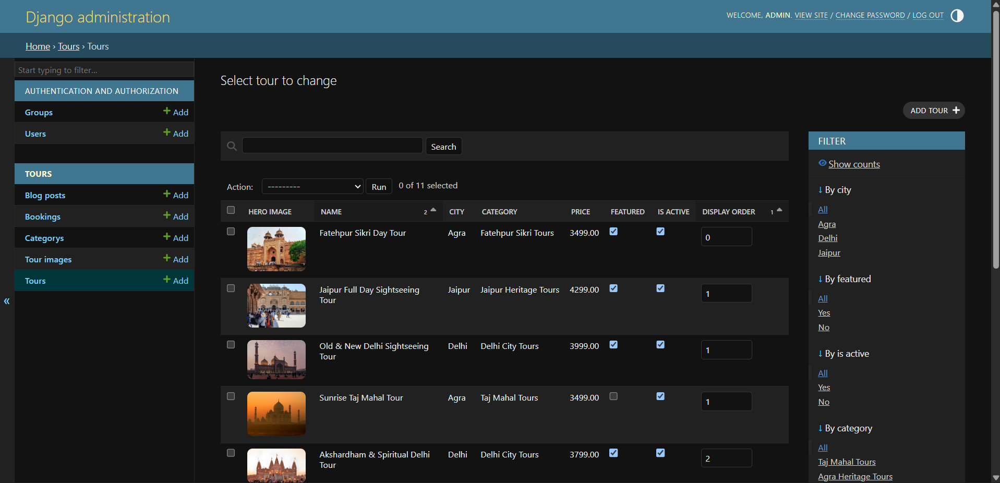

<div align="center">

# 🌍 Trivoya Travels

### Premium Travel & Tourism Management Platform

*A modern full-stack travel booking platform built with Next.js, Django REST Framework, Tailwind CSS and CKEditor 5.*

---


---

**🚧 Live Demo:** Coming Soon

**🌐 Domain:** https://trivoyatravels.com

</div>

---

# 📸 Preview

<p align="center">



</p>

---

# ✨ Overview

Trivoya Travels is a production-ready travel and tourism management platform that enables travelers to explore curated travel experiences across India while allowing administrators to manage tours, blogs, galleries, pricing, and bookings through an intuitive Django Admin dashboard.

The application follows a decoupled architecture with a Next.js frontend consuming REST APIs served by Django REST Framework, making it scalable, maintainable, and deployment-friendly.

---

# 🚀 Key Features

### 🧳 Tour Management

- Dynamic Tour Listings
- Individual Tour Pages
- Hero Images
- Tour Galleries
- Dynamic Pricing
- Discount Pricing
- Tour Highlights
- Day-wise Itinerary
- Inclusions & Exclusions
- City-wise Tours
- Featured Tours

---

### ✍ Travel Blog CMS

- Rich Text Editor (CKEditor 5)
- Featured Images
- Dynamic Blog Pages
- Reading Time Calculation
- SEO Friendly URLs
- Responsive Layout

---

### 📱 Responsive User Experience

- Mobile-first Design
- Tablet Optimized
- Desktop Layout
- Sticky Booking Card
- Smooth Animations
- Image Optimization
- Search & Filtering

---

### 📞 Booking System

- WhatsApp Booking Integration
- Dynamic Tour Selection
- Booking Details
- Contact Information
- Quick Inquiry

---

### ⚙ Administration

- Django Admin Dashboard
- Manage Tours
- Manage Blogs
- Upload Galleries
- Update Pricing
- Featured Tours
- SEO Metadata

---

# 🛠 Tech Stack

| Frontend | Backend | Database | CMS | Styling |
|-----------|----------|-----------|------|----------|
| Next.js 15 | Django 5 | SQLite | CKEditor 5 | Tailwind CSS |

| API | Authentication | Deployment |
|------|----------------|------------|
| Django REST Framework | JWT | Vercel + Render |

---

# 🏗️ System Architecture

```text
                                  Internet Users
                                         │
                                         ▼
                          ┌──────────────────────────┐
                          │      Next.js Frontend    │
                          │   React • Tailwind CSS   │
                          └─────────────┬────────────┘
                                        │
                              REST API Requests
                                        │
          ┌─────────────────────────────┼─────────────────────────────┐
          ▼                             ▼                             ▼
     Tours API                    Blogs API                    Booking API
                                        │
                                        ▼
                         Django REST Framework Backend
                                        │
        ┌───────────────────────────────┼──────────────────────────────┐
        ▼                                                              ▼
   SQLite / PostgreSQL                                          Media Storage
        │                                                              │
        ▼                                                              ▼
 Tour Data • Blogs • Bookings                           Hero Images • Gallery • Blogs
```

---

# 🔄 Application Flow

```text
Visitor
   │
   ▼
Home Page
   │
   ├───────────────► Popular Tours
   │                      │
   │                      ▼
   │               Tour Details
   │                      │
   │                      ▼
   │              WhatsApp Booking
   │
   ├───────────────► Blog Listing
   │                      │
   │                      ▼
   │                Blog Details
   │
   ├───────────────► Gallery
   │
   ├───────────────► About
   │
   └───────────────► Contact
```

---

# 🧩 Project Structure

```text
Trivoya-Travels/
│
├── backend/
│   │
│   ├── config/
│   │     ├── settings.py
│   │     ├── urls.py
│   │     └── wsgi.py
│   │
│   ├── tours/
│   │     ├── migrations/
│   │     ├── admin.py
│   │     ├── models.py
│   │     ├── serializers.py
│   │     ├── views.py
│   │     └── urls.py
│   │
│   ├── media/
│   │     ├── blogs/
│   │     ├── tours/
│   │     │      ├── hero/
│   │     │      └── gallery/
│   │
│   ├── requirements.txt
│   └── manage.py
│
├── frontend/
│   │
│   ├── public/
│   │
│   ├── src/
│   │     ├── app/
│   │     ├── components/
│   │     ├── services/
│   │     ├── styles/
│   │     └── lib/
│   │
│   ├── package.json
│   └── next.config.js
│
├── docs/
│   └── images/
│
└── README.md
```

---

# 🗄️ Database Design

## Category

| Field | Type |
|-------|------|
| id | Integer |
| name | CharField |
| slug | SlugField |

---

## Tour

| Field | Description |
|---------|-------------|
| City | Agra / Delhi / Jaipur |
| Category | Foreign Key |
| Name | Tour Name |
| Slug | SEO Friendly URL |
| Short Description | Card Description |
| Description | CKEditor Content |
| Itinerary | Rich Text |
| Highlights | Text |
| Inclusions | Text |
| Exclusions | Text |
| Duration | Tour Duration |
| Price | Original Price |
| Discount Price | Offer Price |
| Hero Image | Main Image |
| Featured | Boolean |
| Display Order | Sorting |
| SEO Title | Search Optimization |
| SEO Description | Search Optimization |
| Meta Keywords | Search Optimization |

---

## Tour Gallery

Each tour can have multiple gallery images.

Relationship

```
Tour
 │
 ├── Image 1
 ├── Image 2
 ├── Image 3
 └── Image N
```

---

## Blog

| Field | Description |
|---------|-------------|
| Title | Blog Title |
| Slug | SEO URL |
| Content | CKEditor 5 Rich Text |
| Featured Image | Hero Image |
| Published | Boolean |
| Created At | Timestamp |

---

## Booking

| Field | Description |
|---------|-------------|
| Customer Name | Visitor Name |
| Phone | Contact Number |
| Email | Optional |
| Tour | Selected Tour |
| Travel Date | Booking Date |
| Travellers | Number of People |
| Message | Additional Notes |

---

# ⚙️ Core Functionalities

### Tour Management

- Dynamic Tour Packages
- City-wise Filtering
- Featured Tours
- Tour Galleries
- Rich Itinerary
- Dynamic Pricing
- Discount Pricing
- WhatsApp Booking
- SEO Metadata

---

### Blog Management

- Rich Text Editor
- Featured Images
- Reading Time
- Responsive Layout
- Dynamic Blog Pages

---

### Gallery

- Dynamic Images
- Responsive Masonry Layout
- Optimized Loading

---

### Booking

- WhatsApp Integration
- Dynamic Tour Selection
- Instant Contact
- Mobile Friendly

---

# 💻 Frontend Architecture

The frontend is developed using **Next.js 15** with the App Router architecture, providing fast rendering, SEO optimization, and an excellent user experience.

### Frontend Technologies

- Next.js 15
- React 19
- Tailwind CSS
- React Icons
- Fetch API
- Responsive Design
- Image Optimization

---

## Frontend Module Structure

```text
src/
│
├── app/
│   ├── about/
│   ├── blog/
│   ├── book/
│   ├── contact/
│   ├── gallery/
│   ├── tours/
│   │     ├── [slug]/
│   │     ├── agra/
│   │     ├── delhi/
│   │     └── jaipur/
│   │
│   ├── layout.js
│   └── page.js
│
├── components/
│
│   Navbar
│   Footer
│   Hero
│   TourCard
│   TourFilters
│   PopularTours
│   CityToursPage
│   BlogCard
│   BlogHero
│   Gallery
│   Testimonials
│
└── services/
    api.js
```

---

# 🎨 UI Components

## Navigation

- Sticky Navigation
- Desktop Dropdown Menu
- Mobile Drawer Navigation
- Responsive Design
- Scroll Detection

---

## Homepage

- Hero Banner
- Popular Tours
- Why Choose Us
- Testimonials
- Call To Action

---

## Tours

- Search Tours
- Filter by City
- Featured Tours
- Dynamic Pricing
- Discount Pricing
- Responsive Cards

---

## Tour Details

- Hero Banner
- Tour Description
- Highlights
- Day-wise Itinerary
- Image Gallery
- Inclusions
- Exclusions
- Sticky Booking Card
- WhatsApp Booking

---

## Blog

- Featured Blog Layout
- Blog Grid
- Rich Content
- Reading Time
- Hero Images

---

# ⚙ Backend Architecture

The backend is developed using **Django** and **Django REST Framework**, exposing RESTful APIs consumed by the Next.js frontend.

---

## Backend Technologies

- Django 5
- Django REST Framework
- SQLite (Development)
- PostgreSQL (Production Ready)
- CKEditor 5
- JWT Authentication
- Pillow
- CORS Headers

---

## Backend Modules

```text
tours/
│
├── models.py
├── serializers.py
├── views.py
├── admin.py
├── migrations/
└── urls.py
```

---

# 🗃 Data Models

## Category

Stores different tour categories.

↓

## Tour

Stores

- Pricing
- Hero Images
- Description
- Itinerary
- SEO
- Gallery

↓

## Tour Images

Stores multiple images for each tour.

↓

## Blog

Stores travel articles created from Django Admin.

↓

## Booking

Stores customer inquiries and booking requests.

---

# 🔌 REST API

## Tours

| Method | Endpoint | Description |
|---------|-----------|-------------|
| GET | /api/tours/ | Get all tours |
| GET | /api/tours/{slug}/ | Get tour details |

---

## Blogs

| Method | Endpoint | Description |
|---------|-----------|-------------|
| GET | /api/blog/ | List all blogs |
| GET | /api/blog/{slug}/ | Blog details |

---

## Booking

| Method | Endpoint | Description |
|---------|-----------|-------------|
| POST | /api/bookings/ | Create booking |

---

## Authentication

| Method | Endpoint |
|---------|-----------|
| POST | /api/token/ |
| POST | /api/token/refresh/ |

---

# 🔄 Data Flow

```text
User
 │
 ▼
Next.js Component
 │
 ▼
Fetch API
 │
 ▼
Django REST API
 │
 ▼
Serializer
 │
 ▼
Database
 │
 ▼
JSON Response
 │
 ▼
React Component
 │
 ▼
Rendered UI
```

---

# 🖼 Image Management

Images are stored using Django's media handling system.

```text
media/
│
├── blogs/
│
└── tours/
      ├── hero/
      └── gallery/
```

Features

- Dynamic Hero Images
- Tour Gallery Images
- Blog Featured Images
- Responsive Loading
- Optimized Rendering

---

# 🔍 Search & Filtering

Tour filtering is performed client-side using React state.

Supported Filters

- Search by Tour Name
- Filter by City
- Featured Tours
- Instant Updates
- Responsive Search Experience

---

# 📱 Responsive Design

Optimized for

- Desktop
- Laptop
- Tablet
- Mobile

Major responsive improvements include

- Sticky Navbar
- Mobile Navigation Drawer
- Responsive Tour Cards
- Adaptive Image Layouts
- Responsive Booking Sidebar
- Flexible Grid Layouts

---

# 🔒 Security Features

- Django ORM prevents SQL Injection.
- CSRF protection enabled.
- JWT Authentication for protected endpoints.
- Server-side validation.
- Input sanitization.
- Secure media handling.
- Environment variable support for production.

---

# ⚡ Performance Optimizations

- Next.js Image Component
- Dynamic Routing
- Lazy Loaded Pages
- Optimized API Calls
- Responsive Images
- Tailwind CSS Utility Classes
- Component Reusability
- SEO Friendly URLs
- Fast Client-side Navigation

---

# 📈 SEO Optimization

- Dynamic Metadata
- Clean URLs
- Slug-based Routing
- Semantic HTML
- Optimized Images
- Responsive Layout
- Search Engine Friendly Structure

---

# 🚀 Getting Started

Follow the steps below to run Trivoya Travels locally.

---

# 📋 Prerequisites

Before starting, make sure the following software is installed:

### Backend

- Python 3.11+
- pip
- Virtual Environment (venv)

### Frontend

- Node.js 20+
- npm

### Database

- SQLite (Default)
- PostgreSQL (Recommended for Production)

---

# 📥 Clone Repository

```bash
git clone https://github.com/yourusername/trivoya-travels.git

cd trivoya-travels
```

---

# ⚙ Backend Setup

Navigate to the backend folder.

```bash
cd backend
```

Create virtual environment

```bash
python -m venv venv
```

Activate

### Windows

```bash
venv\Scripts\activate
```

### Linux / macOS

```bash
source venv/bin/activate
```

Install dependencies

```bash
pip install -r requirements.txt
```

Apply migrations

```bash
python manage.py migrate
```

Create admin account

```bash
python manage.py createsuperuser
```

Run development server

```bash
python manage.py runserver
```

Backend runs on

```
http://127.0.0.1:8000
```

---

# 🎨 Frontend Setup

Navigate to frontend

```bash
cd frontend
```

Install packages

```bash
npm install
```

Run development server

```bash
npm run dev
```

Frontend runs on

```
http://localhost:3000
```

---

# 🔑 Environment Variables

## Backend

Create

```
backend/.env
```

Example

```env
SECRET_KEY=your_secret_key

DEBUG=True

ALLOWED_HOSTS=127.0.0.1,localhost

CORS_ALLOW_ALL_ORIGINS=True
```

---

## Frontend

Create

```
frontend/.env.local
```

Example

```env
NEXT_PUBLIC_API_URL=http://127.0.0.1:8000/api
```

---

# 📡 API Overview

| Endpoint | Description |
|-----------|-------------|
| GET /api/tours/ | List all tours |
| GET /api/tours/{slug}/ | Tour Details |
| GET /api/blog/ | Blog Listing |
| GET /api/blog/{slug}/ | Blog Details |
| POST /api/bookings/ | Create Booking |

---

# 🖼 Screenshots

## Home Page


---

## Tour Listing



---

## Tour Details



---

## Blog


---

## Blog Details



---

## Gallery



---

## About



---

## Contact



---

## Django Admin



---

# 🌍 Deployment

The application is designed with a decoupled architecture and can be deployed independently.

### Frontend

- Next.js
- Vercel

### Backend

- Django
- Render

### Database

- PostgreSQL

### Domain

- Hostinger Custom Domain

---

# 🛣 Roadmap

Future improvements planned for Trivoya Travels:

- Online Payment Gateway Integration
- User Authentication
- Booking Dashboard
- Customer Reviews & Ratings
- Wishlist Feature
- Tour Availability Calendar
- Multi-language Support
- Email Notifications
- PDF Itinerary Downloads
- Google Maps Integration
- AI-powered Tour Recommendations
- Admin Analytics Dashboard

---

# 🤝 Contributing

Contributions, feature requests, and suggestions are welcome.

If you find a bug or have an improvement in mind, feel free to open an issue or submit a pull request.

---

# 👨‍💻 Author

**Ilma Rehman**

B.Tech Computer Science Engineering

Full Stack Developer | Python | Django | React | Next.js

GitHub: https://github.com/IlmaxRehman

LinkedIn: www.linkedin.com/in/ilma-rehman-b86020309

---

# 📄 License

This project is licensed under the MIT License.

You are free to use, modify, and distribute this software in accordance with the license terms.

---

# ⭐ Support

If you found this project helpful:

⭐ Star the repository

🍴 Fork the project

🐛 Report bugs

💡 Suggest new features

---

<div align="center">

## Thank You ❤️

Built with passion for creating memorable travel experiences across India.

**Trivoya Travels — Explore India. Create Memories.**

</div>